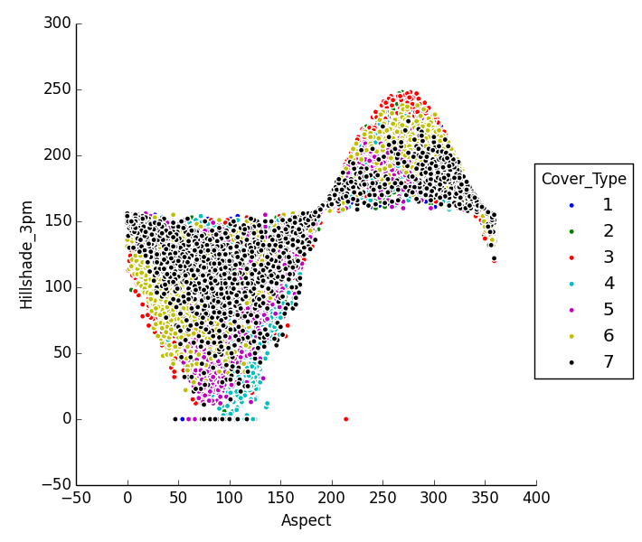
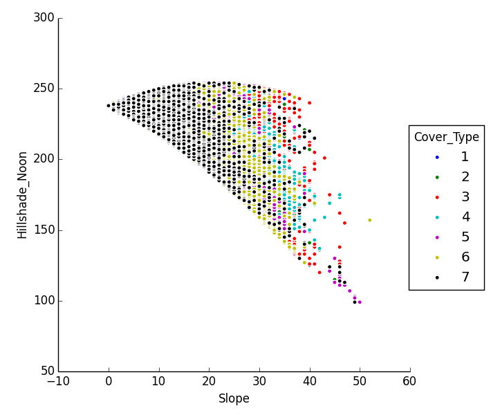
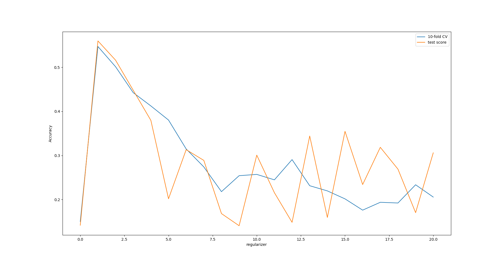
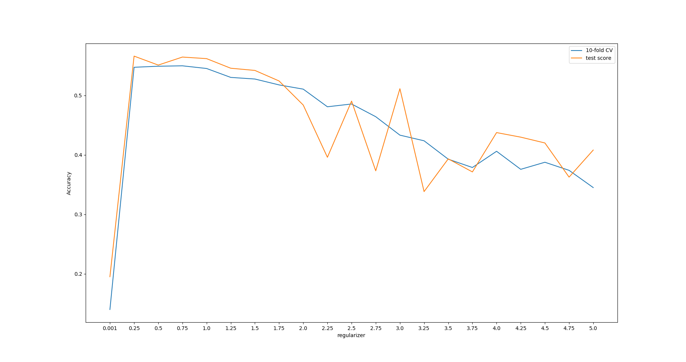
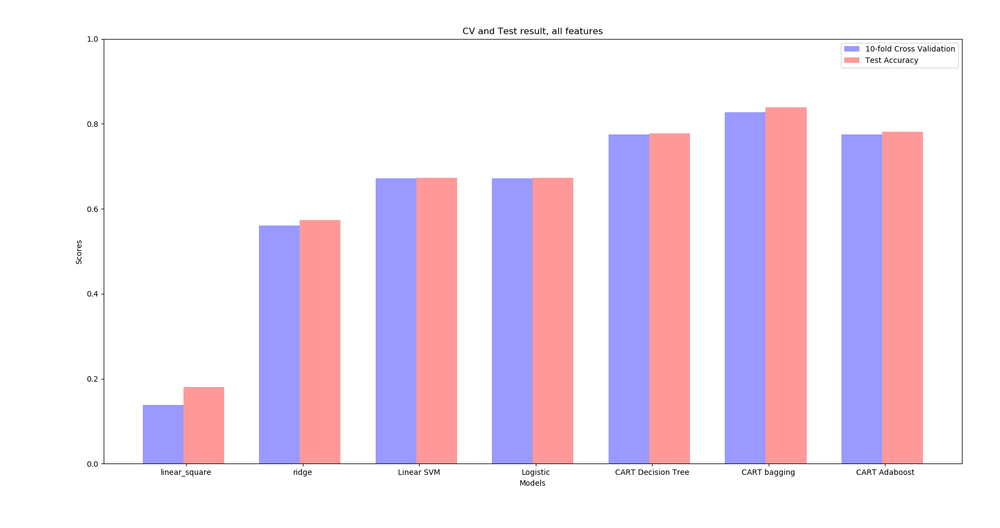
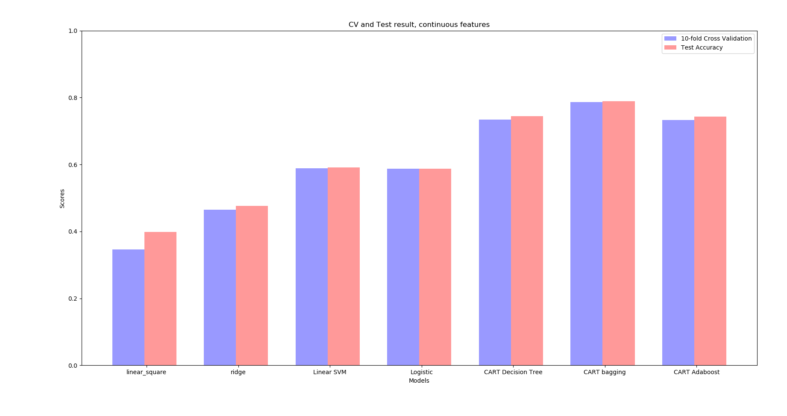
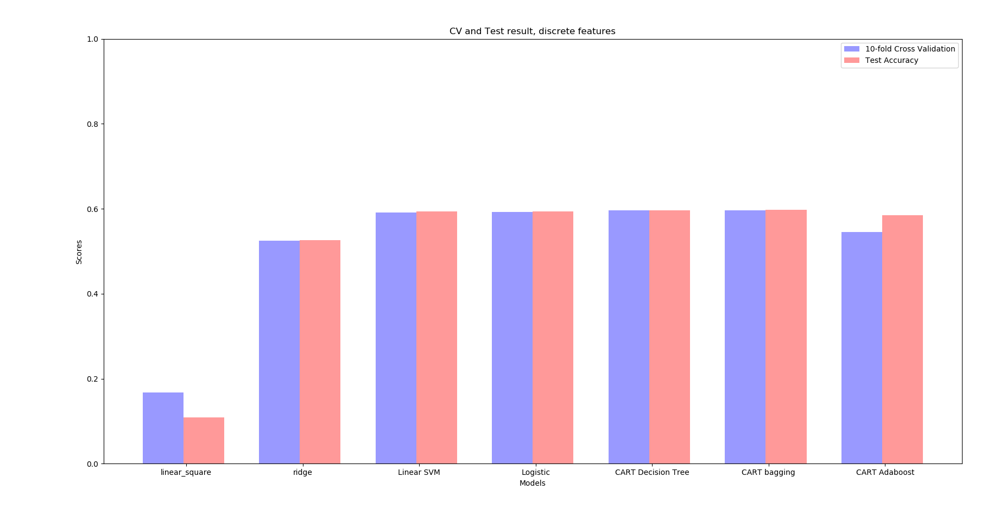
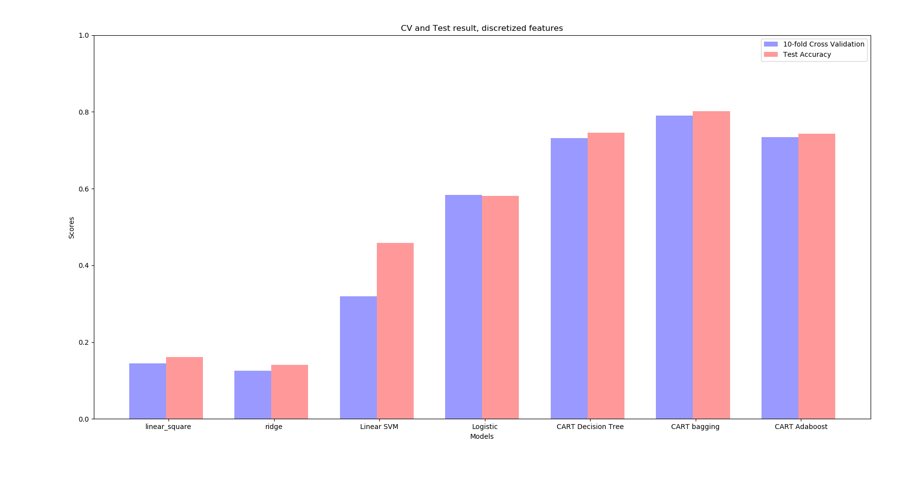
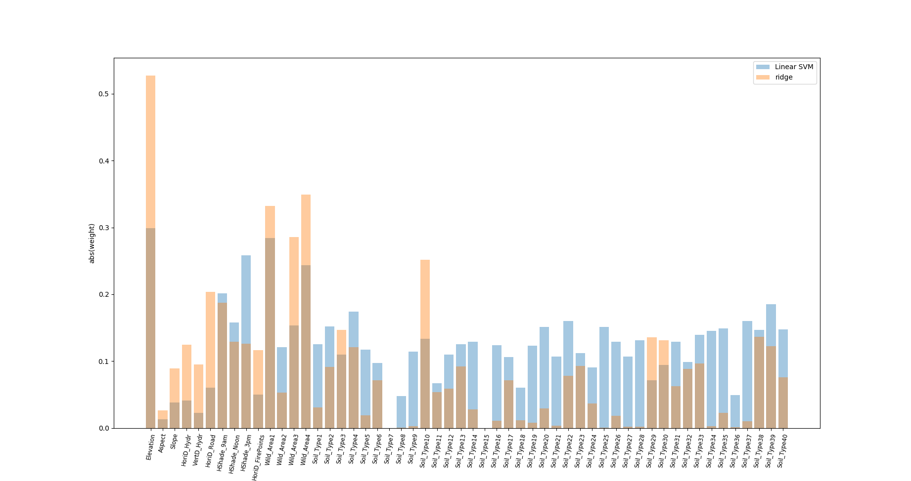

<!-- @import "[TOC]" {cmd="toc" depthFrom=1 depthTo=6 orderedList=false} -->

<!-- code_chunk_output -->

# CSE 517A Application Project Milestone 1
- **Topic**: Forest Cover Type Prediction 
- **Team members**: Chunyuan Li, Jiarui Xing

## Table of Contents

- [CSE 517A Application Project Milestone 1](#cse-517a-application-project-milestone-1)
    - [Table of Contents](#table-of-contents)
    - [1. Dataset Introduction](#1-dataset-introduction)
        - [1.1 General Introduction](#11-general-introduction)
        - [1.2 Statistical description](#12-statistical-description)
        - [1.3 Skewness](#13-skewness)
        - [1.4 Class Distribution](#14-class-distribution)
        - [1.5 Pairwise Correlations of Features](#15-pairwise-correlations-of-features)
    - [2. Data Visualization](#2-data-visualization)
    - [3. Tesing models](#3-tesing-models)
        - [3.1 Data Preprocessing](#31-data-preprocessing)
            - [3.1.1 Basic Preprocessing](#311-basic-preprocessing)
            - [3.1.2 One-hot Encoding](#312-one-hot-encoding)
        - [3.1 Regularizer for Ridge Regression](#31-regularizer-for-ridge-regression)
        - [3.2 Trying Different Models](#32-trying-different-models)
            - [3.2.1 Using All Features](#321-using-all-features)
            - [3.2.2 Using Only Continuous Features](#322-using-only-continuous-features)
            - [3.2.3 Using Only Discrete Features](#323-using-only-discrete-features)
            - [3.2.4 Using One-hot Encoded Discretized Features](#324-using-one-hot-encoded-discretized-features)
    - [4. Interpreting of Data](#4-interpreting-of-data)

<!-- /code_chunk_output -->

## 1. Dataset Introduction
### 1.1 General Introduction
- The dataset is from [Kaggle Forest Cover Type Prediction Task](https://www.kaggle.com/c/forest-cover-type-prediction)
- Our task is to predict the forest cover type (the predominant kind of tree cover) from strictly cartographic variables (as opposed to remotely sensed data).
- The dataset has in total 15120 labeled samples
- The data fields are:
    | Name                               | Meaning                                                         | Format                                         |
    | ---------------------------------- | --------------------------------------------------------------- | ---------------------------------------------- |
    | Elevation                          | Elevation in meters                                             | Continious values                              |
    | Aspect                             | Aspect in degrees azimuth                                       |
    | Slope                              | Slope in degrees                                                |
    | Horizontal_Distance_To_Hydrology   | Horz Dist to nearest surface water features                     |
    | Vertical_Distance_To_Hydrology     | Vert Dist to nearest surface water features                     |
    | Horizontal_Distance_To_Roadways    | Horz Dist to nearest roadway                                    |
    | Hillshade_9am                      | Hillshade index at 9am, summer solstice                         | 0 to 255 index                                 |
    | Hillshade_Noon                     | Hillshade index at noon, summer solstice                        |
    | Hillshade_3pm                      | Hillshade index at 3pm, summer solstice                         |
    | Horizontal_Distance_To_Fire_Points | Horz Dist to nearest wildfire ignition points	Continious values |
    | Wilderness_Area                    | Wilderness area designation                                     | 4 binary columns, 0 = absence or 1 = presence  |
    | Soil_Type                          | Soil Type designation                                           | 40 binary columns, 0 = absence or 1 = presence |
    | Cover_Type                         | Forest Cover Type designation                                   | 7 types, integers 1 to 7                       |

### 1.2 Statistical description
- This part statistically analyses mean, standard deviation, min, max etc. of each feature.   
- Here lists analysis of first three features:
    | Elevation | Aspect       | Slope        |
    | --------- | ------------ | ------------ |
    | Count     | 15120.000000 | 15120.000000 | 15120.000000 |
    | mean      | 2749.322553  | 156.676653   | 16.501587 |
    | std       | 417.678187   | 110.085801   | 8.453927 |
    | min       | 1863.000000  | 0.000000     | 0.000000 |
    | 25%       | 2376.000000  | 65.000000    | 10.000000 |
    | 50%       | 2752.000000  | 126.000000   | 15.000000 |
    | 75%       | 3104.000000  | 261.000000   | 22.000000 |
    | max       | 3849.000000  | 360.000000   | 52.000000 |

### 1.3 Skewness
- Skewness measure how asymmetric the distribution can be.
    - Values close to 0 show less skew
    - some algorithms may benefit if large skew is corrected

- Eg. Skewness of 1st to 5th feature in our dataset：
    | Feature                          | Skewness |
    | -------------------------------- | -------- |
    | Elevation                        | 0.075640 |
    | Aspect                           | 0.450935 |
    | Slope                            | 0.523658 |
    | Horizontal_Distance_To_Hydrology | 1.488052 |
    | Vertical_Distance_To_Hydrology   | 1.537776 |

### 1.4 Class Distribution
- Check number of instances belonging to each class.
- In this dataset:
    | Cover_Type | # of instances |
    | ---------- | -------------- |
    | 1          | 2160           |
    | 2          | 2160           |
    | 3          | 2160           |
    | 4          | 2160           |
    | 5          | 2160           |
    | 6          | 2160           |
    | 7          | 2160           |
    which shows the dataset is quite balanced.

### 1.5 Pairwise Correlations of Features
- Compute correlation between pairs of features.
- Pair of features with high correlation values can be further processed to decrease the number of dimensions. Thus decrease the complexity of the model.
- Below list high correlated pairs (threshold = 0.5):
    | Feature 1                        | Feature 2                       | Correlation value |
    | -------------------------------- | ------------------------------- | ----------------- |
    | Hillshade_9am                    | Hillshade_3pm                   | -0.78             |
    | Horizontal_Distance_To_Hydrology | Vertical_Distance_To_Hydrology  | 0.65              |
    | Aspect                           | Hillshade_3pm                   | 0.64              |
    | Hillshade_Noon                   | Hillshade_3pm                   | 0.61              |
    | Slope                            | Hillshade_Noon                  | -0.61             |
    | Aspect                           | Hillshade_9am                   | -0.59             |
    | Elevation                        | Horizontal_Distance_To_Roadways | 0.58              |

## 2. Data Visualization
- Here we plot highly correlated pairs. Below are scatters of two examples from our dataset.

Relation between Hillshade_3pm and Aspect

Relation between Hillshade_Noon and Slope

- It can be seen from the figure 1 that cover type No.7 scattered around 150 Hillshade_3pm. Other features scattered far away from 150 Hillshaed_3pm. When the aspect is less than 200, all cover types are less than 150 Hillshade_3pm and vice versa. In figure 2, when the slope is low, it is more likely to be cover type 1. With the increasing of the slope, cover type changes to type 6 and then other types.

## 3. Tesing models
### 3.1 Data Preprocessing
#### 3.1.1 Basic Preprocessing
We used some basic data preprocseeing methods including:
- Quantify(Encoding descriptive features into dummy variable)
- Normalization: centering and unification, for continuous data only
- Split data into training and testing set
    > We have 15120 samples in total, and we use 11340 (75%) of them as training set and the other 3780 (25%) as test set.
- Fill missing data (by taking average, on training and test set separately)
- Add 1 more bias dimension

#### 3.1.2 One-hot Encoding
In order to test the proformance of different models with continuous and discrete features, we did 2 additional attempts:
- 1. Separate the training and test set into: 
    > - Training set with only continuous features
    > - Training set with only discrete features
    > - Test set with only continuous features
    > - Test set with only discrete features

- 2. One-hot encoding: Changing all continuous features into discrete features by one-hot encoding. Sample will have 3251 dimensional all-discrete features after encoding instead of orginal 54.

### 3.1 Regularizer for Ridge Regression
We used telescope search to find the optimal regularizer coefficitne for rigde regression. The first range is [0, 20], and the accuracies for 10-fold validation and on test set are (using all original features):

Accuracies with regularizer coefficient in [0,20] 

As is shown in the figure, the optimal efficient value should be in [0, 5], so we did another search in this range:

Accuracies with regularizer coefficient in [0,5] 

From the two figures we can conclude:
- 1. We cannot get a good classifier with either a too small or too large regularizer coefficient: when it is too small, the model easily overfit; when it is too large, the model is forced to be too "simple" to be a effective classifier. 
- 2. In a small range (e.g. [0.25, 1] in the second figure), different coefficient values don't affect the accuracies much. 

In the next part, we will set `regularizer coefficient = 0.5` when comparing different models. 

### 3.2 Trying Different Models
We tested the following models:
- OLS
- Ridge regression with square loss
- Linear SVM
- CART decision tree
- CART decision tree with Bagging
- CART decision tree with AdaBoost
- Logistic regression
- Logistic regression with bagging

 And we collected proformance of these models in follwing cases:
 - with all original features
-  with only continuous features 
-  with only discrete features 
-  with one-hot encoded discrete features:

#### 3.2.1 Using All Features

As we can see, the nonliner model -decision tree- has the best performance and gets even better result with ensembling. And ridge regression and linear SVM works not so well but still much better than OLS, which is likely due to the use of regularizer and maximum margin strategy. OLS gets the worst result due to overfit.
#### 3.2.2 Using Only Continuous Features

In this case most of the models work a little worse sicne we throw out many features. Surprisingly, OLS preforms much better without discrete features!

#### 3.2.3 Using Only Discrete Features

In this case, the result is quite interesting. The accuracies of decision trees decreases, which may indicate that the continuous features contain more useful information for classification. However, the profermance of ridge regression, linear SVM and Logistic regression is quite close to that of only-continuous-features case, which may suggest they are not as good at digging out useful information in the continuous features as decision tree.

#### 3.2.4 Using One-hot Encoded Discretized Features

This result is also quite interesting. Since we lose a little information when encoding, the sight decrease of performance of decision trees and Logistic regression is not surprising (compared with the caee using all orginal features). However, the performance of ridge regression and linear SVM decrease a lot, which seems indicate that linear models are not good at handling discrete features.

## 4. Interpreting of Data
We ploted the absolute value of all dimensions of learned weights of both ridge regression and linear SVM:

From the plot we can see:
- 1. For both classifiers, `Evaluation`, `Wild_Area1` and `Wild_Area4` have large weights, which indicate that forest cover type is closely related to evaluation and varies among areas.
- 2. Some features are ineffective for both two models (e.g. `Soil_Type7` and `Soil_Type15`).
- 3. Linear SVM makes use of all features whilt ridge resression uses main continuous features (first 10 features). 
