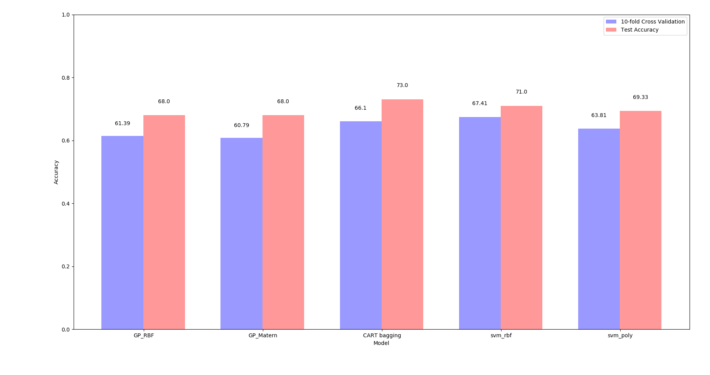
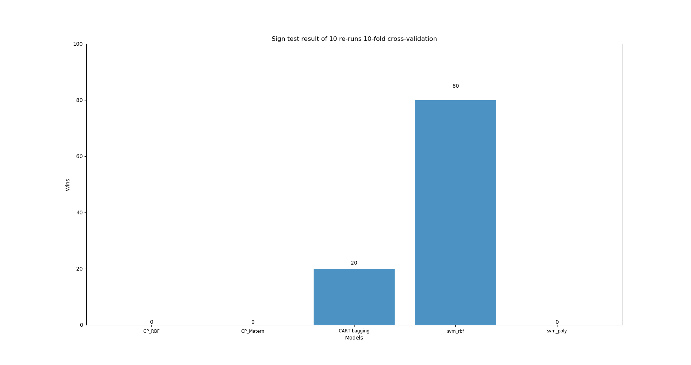
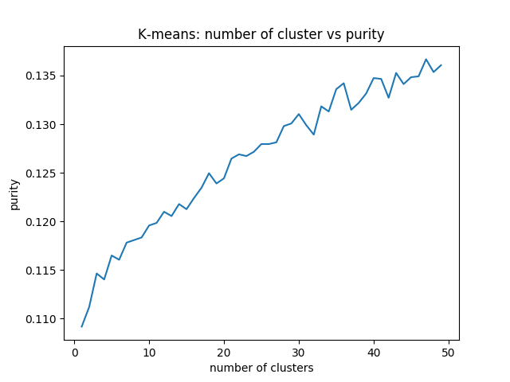
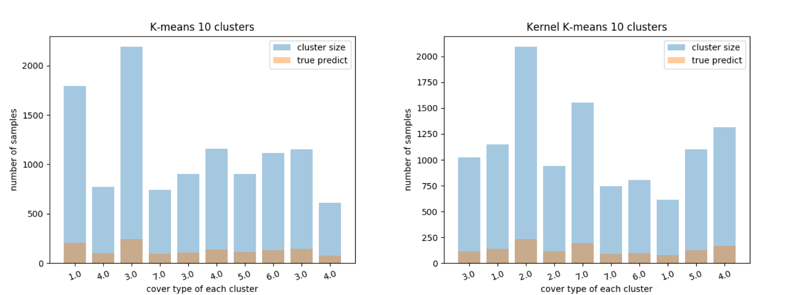

<!--# Tasks
- Due: March (due Mar 31st):
- [milestone 2 - Gaussian Process] Train and run Gaussian Processes. Evaluate and compare the predictions using at least two differnt kernels via 10-fold cross-validation with a suitable error measure (we recommend negative log predictiv density as it takes the predictive uncertainty into account).
- [optional - Support Vector Machine] Train and run a kernel Support Vector Machine. Evaluate the predictions using 10-fold cross-validation and a suitable error measure.
- [optional - Model Evaluation] Compare at 2 differnet methods using 10 re-runs of a 10-fold cross-validation and perform a suitable statistical test to assess whether one of those performs significantly better than the others.
- [optional - Clustering] Cluster the features of your dataset (not using the labels). Evaluate the clusters using the observed data/labels.-->

# CSE 517A Application Project Milestone 2
- **Topic**: Forest Cover Type Prediction 
- **Team members**: Chunyuan Li, Jiarui Xing

<!-- @import "[TOC]" {cmd="toc" depthFrom=1 depthTo=6 orderedList=false} -->

<!-- code_chunk_output -->

- [CSE 517A Application Project Milestone 2](#cse-517a-application-project-milestone-2)
  - [1. Model Training, Evaluation and Comparison](#1-model-training-evaluation-and-comparison)
    - [1.1 Model Training](#11-model-training)
    - [1.2 Model Evaluation and Comparison](#12-model-evaluation-and-comparison)
  - [2. Clustering](#2-clustering)

<!-- /code_chunk_output -->

## 1. Model Training, Evaluation and Comparison
### 1.1 Model Training
- **Model used.** In this milestone we used 5 models: SVM with RBF and polynomial kernel, Gaussian Procecss with RBF and Matern kernel and CART decision tree with bagging.
- **Hyperparameter.** We used telescope search and cross validation to select the hyperparameters of SVM.
- **One-vs-one / one-vs-rest.** The perform of Gaussian Process using One-vs-one / one-vs-rest are as following:

  |                   | One-vs-rest                 | One-vs-rest   | One-vs-one                  | One-vs-one    |
  | ----------------- | --------------------------- | ------------- | --------------------------- | ------------- |
  |                   | 10-fold validation accuracy | Test accuracy | 10-fold validation accuracy | Test accuracy |
  | GP(RBF kernel)    | 36%                         | 37%           | 66.2%                       | 70.0%         |
  | GP(Matern kernel) | 37.0%                       | 53.0%         | 66.1%                       | 70.0%         |
  
  From the table we can see due to the imbalance problem in one-vs-rest strategy, the classifier preforms very badly. In the remaining part of the milestone, we will use one-vs-one strategy. 

### 1.2 Model Evaluation and Comparison
- **Accuracy and Standard Derivation.**
  Though negative log predictive density is the suggested error measure, we cannot use it since we used one-vs-one strategy. Instead we used standard derivation of cross validation score to capture the uncertainty. And validation and test accuracy are used to measure the performance.
- **Statistical Test.**
  We also used sign test as a model statistical comparison method. 
- **Evaluation and Comparison Result.**
  - 1 ) Model Accuracy
  

  
  

  
Figure 1.1 Model Accuracy

  
  From Figure 1.1 we can see these models have similar performance, while CART tree with bagging have the best test accuracy and 2 SVMs preform better than the two Gaussian Process classifiers.  

  - 2 ) Standard Derivation
  The standard derivation of models are:    
    
  | Model                        | STD    |
  | ---------------------------- | ------ |
  | SVM (with RBF kernel)        | 0.0323 |
  | SVM (with Polynomial kernel) | 0.0326 |
  | GP (with RBF kernel)         | 0.0302 |
  | GP (with Matern kernel)      | 0.0307 |
  | CART Decision Tree           | 0.0509 |
  As is shown in the table, though CART tree has the highest test accuracy, it seems also more unstable than other models

  - 3 ) Sign Test Result
  

  
  

  
Figure 1.2 Sign Test

  - 4 ) Time and Memory
  The time of [Training + Cross Validation + Testing] of different models are (without hyperparameter selecting):

  | Model                        | Time (s) |
  | ---------------------------- | -------- |
  | SVM (with RBF kernel)        | 16.64    |
  | SVM (with Polynomial kernel) | 15.84    |
  | GP (with RBF kernel)         | 16.55    |
  | GP (with Matern kernel)      | 16.82    |
  | CART Decision Tree           | 16.99    |

## 2. Clustering
### 2.1 Evaluation metric - Purity
  

  N – number of samples

  k – number of clusters

  ci – ith cluster

  ti – classification type of each cluster
### 2.2 Choose number of clusters

  

Figure 2.1 Number of clusters vs purity

The sharp turn point of the figure is nor clear. Therefore, we choose 10 clusters in the following experiment.
### 2.3 K-means vs Kernel K-means

  

Figure 2.2 Performance of K-means vs Kernel K-means

Kernel K-means has purity of 0.1194 vs K-means 0.1191. 
### 2.4 Result analysis
  K-means clustering assumes the variance of the distribution of each attribute (cluster) is spherical. However in our dataset, this assumption does not hold. Besides, K-means is trying to minimizing the squared Euclidean distance between samples and cluster centers. Squared Euclidean distance is not a good metric in high dimensions and it will result in curse of dimension.
