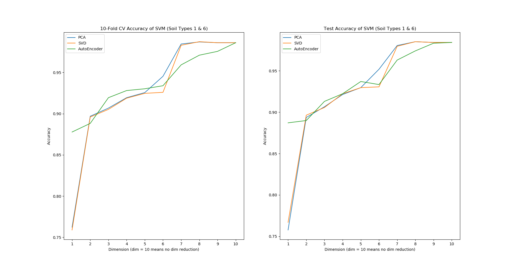

<!--
[milestone 3 - Dimensionality Reduction] 
Perform dimensionality reduction (PCA/SVD) 
    and visualize the data (incorporate the class leables in your visualization), 
    as well as use the new feature representation in a classifier/regression method you evaluated before. 
Compare the predictions results using The model evaluation strategy dervied in milestone xx.

[optional - Efficiency] 
Compare the traning time and test time of the milestone 1, 2, and 3 methods 
    (plus task 4 - if your team did it). 
Use the average (or mode) runtime over 10 re-runs 
    and perform a suitable statistical test to assess whether one of those performs significantly better 
    than the others w.r.t. efficieny of training and test time. 
-->
# CSE 517A Application Project Milestone 3
- **Topic:** Forest Cover Type Prediction
- **Team members:** Chunyuan Li, Jiarui Xing

- [CSE 517A Application Project Milestone 1](#cse-517a-application-project-milestone-1)
  - [1. Dimension Reduction](#1-dimension-reduction)
    - [1.1 Task Description](#11-task-description)
    - [1.2 Experiment Setting](#12-experiment-setting)
    - [1.3 Experiment Results](#13-experiment-results)
      - [1.3.1 2 Classes](#131-2-classes)
        - [Accuracy](#accuracy)
      - [Visualization](#visualization)
      - [1.3.2 All 7 Classes](#132-all-7-classes)
        - [Accuracy](#accuracy)
      - [Visualization](#visualization)
  - [2. Nerual Network](#2-nerual-network)
  - [3. Efficiency](#3-efficiency)
    - [3.1 Task Description](#31-task-description)
    - [3.2 Experiment Setting](#32-experiment-setting)
    - [3.3 Experiment Results](#33-experiment-results)

## 1. Dimension Reduction
### 1.1 Task Description
- Perform dimensionality reduction (PCA/SVD) and visualize the data (incorporate the class leables in your visualization), as well as use the new feature representation in a classifier/regression method you evaluated before. 
- Compare the predictions results using The model evaluation strategy dervied in milestone xx.

### 1.2 Experiment Setting
- **Methods.** In this section, we experiented on 3 dimension reduction methods (PCA, SVD and autoencoder). Since PCA and SVD can only work with continuous features, we used only 10 continuous features of our data. 
  

    
  

  
Figure 1.1 Experiment Architecture

- **Tasks.** We tried the 3 methods with target dimension from 1 to 9 and compute the classification accuracies (10-fold cross validation and test accuracy) using SVM under each situation. In addition, we also compute the accuracy with all 10 features as comparsion. We also visualized the data when target dimension is 3.
- **Autoencoder Architecture.** The autoencder has 2 architectures uder different target dimension:
  

    
  

  
Figure 1.2 Autoencoder Architecture (target dimension < 5)

  

    
  

  
Figure 1.3 Autoencoder Architecture (target dimension >= 5)

- **Class Number.** From the previous 2 milestones we found that our task is quite hard since the highest test accuracy we got is about 81%, in this milestone we also tried work with only 2 classes out of all 7 (see section 1.3.1).

### 1.3 Experiment Results
#### 1.3.1 2 Classes
##### Accuracy

  

Figure 1.3 Validation and Test Accuracy (2 classes)

As is shown in Fig 1.3, when we reduce the dimension to only 1, both the validation and test accuracy of autoencoder is much higher than that of SVD and PCA. In other cases, however, autoencoder preforms only slightly better than others. PCA and SVD give quite close results. Considering the fact that training an autoencoder costs much more time than implementing PCA or SVD, in our experiment autoencoder is not a good choice.

##### Visualization

  

Figure 1.4 3D Visualization (PCA)

  

Figure 1.5 3D Visualization (SVD)

  

Figure 1.6 3D Visualization (Autograder)

Fig 1.4-1.6 show the plot when target dim is 3. The result of PCA and SVD are very similiar as well as their corresponding accuracies in the previous section, while the autoencoder gives quite different result.

#### 1.3.2 All 7 Classes
##### Accuracy

  

Figure 1.7 Validation and Test Accuracy (2 classes)

As is shown in Fig 1.7, the autoencoder preforms better at lower target dimensions and PCA and SVD gives silimiar results. 

##### Visualization

  

Figure 1.8 3D Visualization (PCA)

  

Figure 1.9 3D Visualization (SVD)

  

Figure 1.10 3D Visualization (Autograder)

From fig 1.8-1.10 we can draw similiar result as in the 2 classes case: the PCA and SVD give close result while autoencoders doesn't. We can also see that there isn't a clear border among classees, which again shows the task is a hard one.

## 2. Nerual Network

## 3. Efficiency
### 3.1 Task Description
Compare the traning time and test time of the milestone 1, 2, and 3 methods. Use the average (or mode) runtime over 10 re-runs and perform a suitable statistical test to assess whether one of those performs significantly better than the others w.r.t. efficieny of training and test time. 

### 3.2 Experiment Setting
In this section, we tested 10-rerun average of:
- 1) time of [fitting + 10-fold cross validation + testing]; 
- 2) cross validation and test accuracy;
- 3) sign test result;

on the following models (from previous milestones):
- ridge classification (linear classifier with square loss and l2 penalty)
- lasso classification (linear classifier with square loss and l1 penalty)
- Gaussian Process (with RBF kernel)
- SVM (with RBF kernel)
- SVM (with linear kernel)
- logistic regression
- CART Decision Tree
- CART Decision Tree (with bagging)

### 3.3 Experiment Results
#### Efficiency

  

Figure 3.1 Model Efficiencies

Figure 3.1 shows the total time of training and test for each model, from which we can see that Gaussian process is extremely slow, while other methods are in the same level. Among other methods, surprisingly CART decision tree cost least time while linear SVM is the slowest one.

#### Accuracy

  

Figure 3.2 Model Accuracies

As is shown in figure 3.2, Gaussian process gives good but not much better result, which may indicate in our task Gaussian process in not a good choice considering its "endless" training time. On the other side, CART decision tree gives acceptive result using shorest time, and CART desicion tree with bagging gives the best result using not very long time.

#### Sign Test

  

Figure 3.3 Sign Test Result

We choose sign test as statistical test for our task. Same as the last part, CART decision tree with bagging preforms best. Surprisingly, SVM with linear kernel preforms very well in sign test, which may indicate linear SVM is very robust and gets high cross-validation scores (actually from figure 3.2 we can see linear SVM's CV score does be quite high).