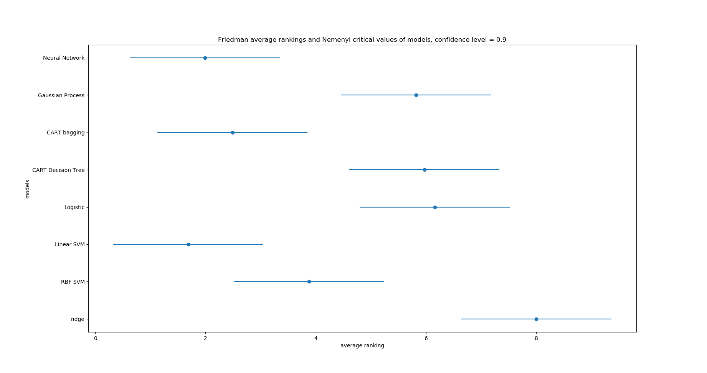

<!-- [optional - Semi-Supervised Learning]
    Perform semi-supervised learning and compare your evaluations to a comparable method 
    (you want to achieve a fair compariosn) using the model evaluation strategy 
        dervied in milestones 1 and 2.

MORE: setting kernel hyperparameters(rbf/knn, gamma in rbf)        

[milestone 4 - Final Comparison]
    Compare all methods (at least the 3 milestones) you used throughout the semester 
    using 10 re-runs of a 10-fold cross-validation 
        and perform a suitable statistical test 
        to assess whether one of those performs significantly better than the others. -->

# CSE 517A Application Project Milestone 4
- **Topic:** Forest Cover Type Prediction
- **Team members:** Chunyuan Li, Jiarui Xing

## 1. Semi-Supervised Learning
### 1.1 Tasks
Perform semi-supervised learning and compare your evaluations to a comparable method (you want to achieve a fair compariosn) using the model evaluation strategy dervied in milestones 1 and 2.

### 1.2 Experiment Design
In this section we tried to use partly labeled data to train a classifier and see how the preformance changes with with different ratios of unlabeled data, and also tested the model using batch data. In details the data was:
- partly labeled data: all samples, 10% labeled
- partly labeled data: all samples, 30% labeled
- partly labeled data: all samples, 50% labeled
- batch data: 10% samples, all labeled
- batch data: 30% samples, all labeled
- batch data: 50% samples, all labeled
- All samples, all labeled

And we used CART decision tree with bagging as the classifier.

### 1.3 Experiment Result

    
  

Figure 1.1 Accuracies with different data

As is shown in figure 1.1, the accuracies using partly labeled data are similiar to that of batch data with same amount of labeled samples, which indicates that the unlabeled data doesn't give help. What's more, the accuracy of 10% labeled (and 90% unlabeled) data is much worse that that of 10% batch data, which suggests that label propagation mispredicted many labels and lowered the preformance.

## 2. Final Comparsion
### 2.1 Tasks
Compare all methods (at least the 3 milestones) you used throughout the semester using 10 re-runs of a 10-fold cross-validation and perform a suitable statistical test to assess whether one of those performs significantly better than the others. 

We tested on the following models:
- Ridge classifier (linear classifier with L2 regularization)
- Lasso classifier (linear classifier with L1 regularization)
- Gaussian process
- SVM with linear and rbf kernel
- Logistic regression
- CART decision tree (with and without bagging)
- Neural network (with 2 layers)

And since Gaussian process is greatly memory-consuming, in this section we train all models on only 1000 samples.

### 2.2 Accuracies

    
  

Figure 2.1 Accuracies of different models

As is shown in figure 2.1, the accuracies of nonlinear models are quite close, among which CART decision tree with bagging has both highest cross validation and test accuracy. Linear SVM preforms best among the linear models and has quite high cross-validation accuracy.

<!-- ### 2.3 Sign Test

    
  

Figure 2.2 Sign test result of different models

We used sign test as statistical test and the result is shown in figure 2.2. We can see CART decision tree with bagging has not only the highest accuracy but also the highest rubostness. Suprisingly, linear SVM preforms very well in sign test, which may due to that as a linear classifier it is harder to overfit than other nonlinear methods. -->

### 2.3 Feiedman Test and Nemenyi Post-hoc Test

    
  

Figure 2.2 Feiedman Test and Nemenyi Post-hoc Test

We uesd Feiedman test and Nemenyi post-hoc test as our statistical test. We trained our models on 10 re-run 10 fold cross validation and computed their average ranks. The result is shown in figure 2.2, where the points represent the average raks. The width of error bars beside the average ranks are the critical values of Nemenyi test, and having overlap area between bars of two classifiers means that we do not have confidence - over confidence level - to say they have statictical difference in average rank. As is shown is figure 2.2, when confidence level is 90%, linear SVM, neural network (with same architecture as in milestone3) and CART decision tree with bagging perform statistically better than Gaussian process, CART decision tree, Logistic regression and ridge regression. Though (quite surprisingly) linear SVM has the highest average rank, statistically it has no statistical difference with the following 3 classifiers (with 90% confidence).

### 2.4 Efficiency

    
  

Figure 2.3 Total training and test time of different models

Figure 2.3 shows the total 10 re-run time of training and test for each model. We can see Gaussian process is really slow. The fastest method is CART decision tree. Consider it gives us pretty good accuracy, it is the best model if we want to save time. CART decision tree with bagging is also quite fast and may be our "most valued classifier".
